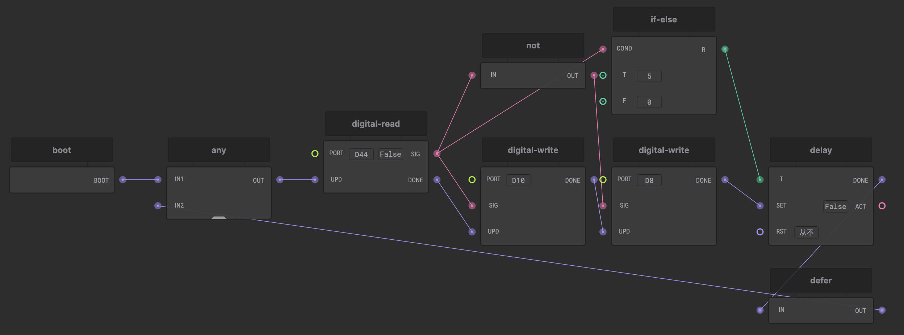

## 用[Ticos Studio](https://downloads.ticos.cn/studio/)编写智能交通信号灯

我们可以想象这么一个场景，当晚上1点下班以后，我们开车回家，路上一个行人都没有，结果一路红灯，3分钟的路程开了30分钟。这是十分痛苦的。

所以，我们来做一个智能交通信号灯解决这个问题：

当没人的时候，信号灯绿灯常亮，让车辆通行，一旦检测到有人的时候，信号灯转为红灯，让行人通过。

 

#### 结果展示

#### 工作流示例

#### 项目使用：

#### 哔站演示视频，欢迎关注

[演示地址](https://www.bilibili.com/video/BV1xa411V7en/)

 

#### 欢迎关注我们的公众号，更多信息会通过公众号第一时间更新。

